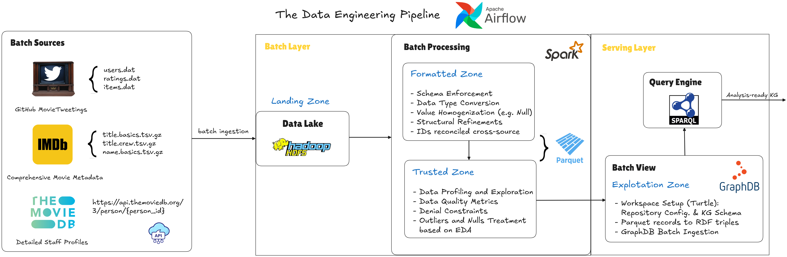
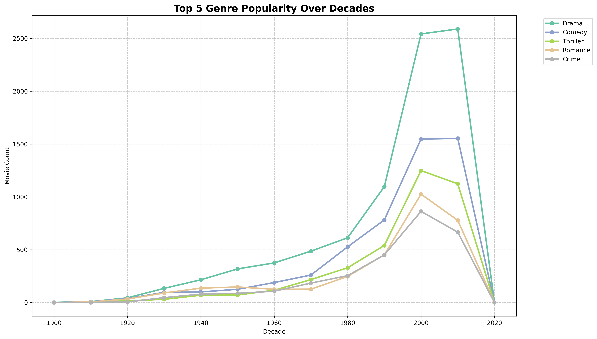

# 🎥 Movie Knowledge Graph: Scalable DataOps & Analytics

This repository presents a robust, containerized pipeline for constructing and analyzing a comprehensive movie knowledge graph. The project leverages modern DataOps principles to enable scalable data engineering, semantic modeling, and advanced analytics.

---

## 🗂️ Project Overview

The system is designed to ingest raw data from sources such as IMDb, TMDb, and MovieTweetings, perform rigorous cleaning and validation, and transform the data into a semantic knowledge graph. This knowledge graph supports advanced analytics and interactive visualizations, all managed through a reproducible and automated workflow.

A central feature of the project is its implementation of the **lambda architecture** for DataOps, which ensures efficient handling of both real-time and batch data processing. The following diagram illustrates the architecture:

<p align="center">
  
</p>

The architecture is structured to balance speed and reliability. The batch layer processes large volumes of historical data to ensure accuracy and completeness, while the speed layer manages new, incoming data for low-latency updates. The serving layer integrates both, providing unified and up-to-date data for querying and analysis.

---

## ⚙️ Workflow and Technical Features

The data pipeline is orchestrated using Apache Airflow, deployed within Docker containers for ease of setup and reproducibility. Data is ingested through automated scripts, standardized, validated, and subsequently loaded into a graph database (GraphDB). Analytical scripts, utilizing Python, Pandas, and PyKEEN, extract insights and generate visualizations.

The workflow is organized into the following stages:

- **Landing**: Collection and storage of raw data.
- **Formatting**: Data cleaning and harmonization.
- **Trusted**: Quality assurance and validation.
- **Exploitation**: Population and exposure of the knowledge graph for querying.
- **Analysis**: Advanced analytics and machine learning for pattern discovery.

Key technical highlights include:

- **ETL Orchestration**: Airflow DAGs manage all stages from ingestion to analysis.
- **Semantic Knowledge Graph**: Data is modeled for expressive SPARQL queries.
- **Batch and Stream Processing**: The lambda architecture supports both historical and real-time data.
- **Machine Learning Integration**: Embedding models (via PyKEEN) enable clustering and relationship discovery.
- **Visualization**: Analytical results are presented through dashboards and publication-quality plots.

---

## 📊 Example: Genre Trends Analysis

The system enables exploration of trends such as the evolution of movie genres over time. The following SPARQL query retrieves the number of movies per genre by decade:

```sparql
PREFIX ex: <http://example.org/moviekg/>
SELECT ?decade ?genreName (COUNT(?movie) as ?count)
WHERE {
    ?movie a ex:Movie ;
           ex:startYear ?year ;
           ex:has_genre ?genre .
    ?genre ex:genre_name ?genreName .
    BIND (FLOOR(?year/10)*10 AS ?decade)
    FILTER (?year > 1900)
}
GROUP BY ?decade ?genreName
ORDER BY ?decade
```

The resulting visualization, generated by the pipeline, is shown below:

<p align="center">
  
</p>

This plot illustrates the temporal dynamics of genre popularity, providing insights into cultural and industry trends across decades.

---

## 🚀 Getting Started

1. **Clone the repository** and navigate to the project directory.
2. **Start the stack** using Docker Compose:
   ```bash
   docker-compose up -d
   ```
3. **Access Airflow** at [http://localhost:8080](http://localhost:8080) to monitor and control the pipeline.

---

## 👤 Authors

- Alberto Jerez Cubero - alberto.jerez@estudiantat.upc.edu - @albertojc6
- Jordi Granja Bayot - jordi.granja.i@estudiantat.upc.edu - @jordigb4
- Marta Carrión Bastida - marta.carrion@estudiantat.upc.edu - @Marta-Carrion-Bastida